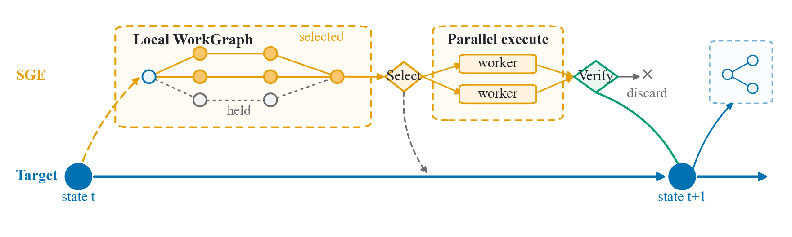

# Speculative Graph Execution

[](https://github.com/Joey-Lei/sge-coding-agents/actions/workflows/ci.yml)
[](LICENSE)
[](pyproject.toml)

**Small code release for Speculative Graph Execution.**



Speculative Graph Execution (SGE) asks whether a coding agent can release selected, dependency-ready work before the target agent confirms every later step. A semantic WorkGraph exposes structure, a frozen topology-first gate estimates finite-worker headroom, and verification controls what can enter confirmed state.

This is the small public code release accompanying the SGE workshop manuscript. It contains graph-analysis utilities and selected frozen evidence; raw traces, provider integrations, evaluator assets, and a production executor are not included.

## Quick start

The core package uses only the Python standard library at runtime.

```bash
git clone https://github.com/Joey-Lei/sge-coding-agents.git
cd sge-coding-agents
python3 -m venv .venv
. .venv/bin/activate
python3 -m pip install -e .

sge analyze examples/minimal_workgraph.json \
  --duration-model type_weighted --workers 4
```

The included WorkGraph has a type-weighted four-worker ceiling of `1.2222x`. At the paper's frozen `1.10x` operating threshold, it is an admitted structural candidate. The command analyzes an annotated DAG only; it does not execute tools or claim end-to-end acceleration.

## Results

| Evidence | Frozen coverage | Result |
| --- | --- | --- |
| Historical same-trace replay | 10 clean Web-Bench traces | Aggregate unbounded ceiling **4.269x**; aggregate P=4 list ceiling **3.406x**; case median **5.229x** |
| Topology-first admission | 188 nested windows from 7 cases and 4 physical repositories | Filters **70.2%**; admits **52/53** observed-high windows; FAR **7.14%** versus Matched-Random **62.5%--82.14%** |
| Exact-duration opportunity | 9 audited action DAGs across 6 repositories | P=4 mean / median / maximum ceiling: **1.2138x / 1.1770x / 1.5297x** |

These are structural and retrospective results. They do not establish a quality-equivalent prospective SGE speedup.

## Reproduce

The optional [reviewer snapshot](artifact/reviewer_snapshot) packages sanitized derived rows, deterministic checks, provenance, and the claim map. It runs offline after dependencies are installed:

```bash
python3 -m pip install -e ".[artifact,dev]"
python3 reproduce.py
python3 -m pytest -q
python3 tools/check_release.py
```

See the [evidence guide](docs/evidence.md) for interpretation boundaries and the [claim map](artifact/reviewer_snapshot/CLAIMS.md) for source paths and allowed claims.

## Notes

Released here: graph analysis, finite-worker scheduling bounds, topology-first admission evidence, and a reviewer-safe data slice.

Open research work: online local-WorkGraph prediction, a bounded production executor and verifier, and a matched Target-Default evaluation with a common quality evaluator and full cost accounting.

## Citation

Use [CITATION.cff](CITATION.cff) to cite this software artifact. The project is released under the [MIT License](LICENSE).
