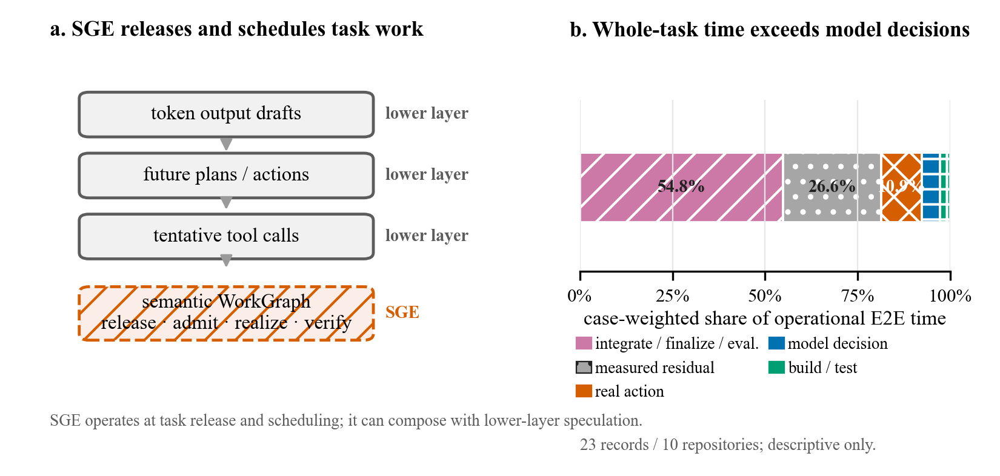

# Speculative Graph Execution

**Task-layer speculative execution for coding agents, represented as a rolling semantic WorkGraph.**

Speculative Graph Execution (SGE) asks a systems question: while a coding agent is working, can we identify dependency-ready work early, execute only the safe frontier, and verify or fall back before committing the result? SGE operates above token decoding and below whole-agent orchestration.

This repository is the clean, reviewer-facing release. It contains an installable analysis core, the trace-to-WorkGraph contract, a minimal example, and a frozen offline artifact that recomputes the paper evidence without network, model, or evaluator calls.

## SGE in 30 seconds

~~~mermaid
flowchart LR
    A[Ongoing coding trace] --> B[Rolling semantic WorkGraph]
    B --> C[Work / span bound]
    C --> D{Admit ready frontier?}
    D -->|yes| E[Isolated speculative work]
    D -->|no| F[Continue serially]
    E --> G[Verify]
    G -->|valid| H[Commit artifact]
    G -->|invalid| F
~~~

The research object is the rolling **predict → bound → admit → execute → verify** loop. This release implements and tests the offline graph model, finite-worker scheduler, replay utilities, observed-action trace conversion, annotation contracts, and evidence recomputation. A production online controller and a quality-equivalent prospective end-to-end speedup result are not claimed.

## Quick start

The core package has no runtime dependencies outside the Python standard library.

~~~bash
git clone https://github.com/decentralizedblack-maker/sge-coding-agents.git
cd sge-coding-agents
python3 -m venv .venv
. .venv/bin/activate
python3 -m pip install --upgrade pip
python3 -m pip install -e .

sge analyze examples/minimal_workgraph.json --workers 1,2,4
~~~

The command reports total work, critical-path span, peak ready parallelism, relaxed worker bounds, and deterministic list-schedule estimates. Its output labels the result as a scheduling opportunity—not measured end-to-end acceleration.

Python users can call the same API directly:

~~~python
from pathlib import Path
from sge import summarize_dag

result = summarize_dag(
    Path("examples/minimal_workgraph.json"),
    workers=[1, 2, 4],
)
print(result["workers_4_list_speedup"])
~~~

## Evidence at a glance

| Evidence layer | What is included | What it supports |
| --- | --- | --- |
| Structural ceiling | 9 exact-duration action DAGs | Work/span opportunity; not realized whole-task speedup |
| Admission screen | 188 rolling windows, including a 58-window nontrivial sensitivity | Duration-blind ceiling classification under audited topology |
| Local mechanism | Historical 10-window executor smoke and command-heavy negative smoke | Closure/fallback behavior, including adverse evidence |
| Functional observations | Two historical whole-prompt summaries | Compatibility observations only; not prospective causal SGE speedup |
| Strict failure cases | P007 and P018 with null formal paired metrics | Protocol rejection is preserved symmetrically |
| Prospective end-to-end SGE | Not present | No <code>alpha_SGE</code>, SOTA, production, or generalization claim |

The exact claim-to-evidence map is in [artifact/reviewer_snapshot/CLAIMS.md](artifact/reviewer_snapshot/CLAIMS.md). The [limitations](docs/limitations.md) are part of the release contract, not optional caveats.

## Reproduce the reviewer artifact

The default path is offline, cross-platform, and non-mutating. It recalculates quantitative claims and renders five evidence-governed figures in temporary storage, compares the claims with the sealed outputs, checks invalid-pair preservation, scans for restricted material, and verifies the SHA-256 manifest. Maintainers can explicitly refresh platform-bound renderings with `python3 reproduce.py --refresh`.

~~~bash
python3 -m pip install -e ".[artifact,dev]"
python3 reproduce.py
python3 -m pytest -q
python3 tools/check_release.py
~~~

Expected terminal status:

~~~json
{"artifact": "artifact/reviewer_snapshot", "mode": "offline-portable", "status": "pass"}
~~~

See [reproduction instructions](docs/reproduction.md) for the fast, full, and audit paths. Reproduction uses zero network, model, and official-evaluator calls after dependencies are installed.

## Repository map

| Path | Purpose |
| --- | --- |
| [src/sge](src/sge) | Stable reviewer-safe Python API and CLI |
| [examples](examples) | Small, inspectable WorkGraph input |
| [contracts](contracts/trace_to_reference_dag) | Annotation, adjudication, and JSON-schema contract |
| [artifact/reviewer_snapshot](artifact/reviewer_snapshot) | Frozen derived evidence, figures, provenance, and audit code |
| [docs](docs) | Architecture, evidence, reproduction, data, and limitations |
| [tests](tests) | Public API and adjacent-failure tests |
| [.github/workflows](.github/workflows) | Clean-environment CI |

The frozen artifact is intentionally separate from the public API. Live provider adapters, raw runtime telemetry, session histories, hidden evaluator assets, gold patches, unrestricted logs, and the historical prototype runners are excluded.

## Scientific boundary

SGE is not token-level speculative decoding, unrestricted parallel shell execution, or a claim that more workers always help. Dependency errors, side effects, verification cost, prediction miss rate, and fallback overhead can erase structural headroom. The strongest result in this repository is therefore an auditable opportunity and mechanism study, not a prospective end-to-end performance result.

For the definitions and invariants, read [architecture](docs/architecture.md). For the negative evidence and non-transferable assumptions, read [limitations](docs/limitations.md).

## Citation, license, and contributions

Use [CITATION.cff](CITATION.cff) to cite this software artifact. Paper metadata can be added once the archival paper record is available.

Original project code and documentation are released under the [Apache License 2.0](LICENSE). Dependencies and benchmark-derived identifiers are described in [THIRD_PARTY_NOTICES.md](THIRD_PARTY_NOTICES.md). Contributions are welcome through [CONTRIBUTING.md](CONTRIBUTING.md); security-sensitive reports should follow [SECURITY.md](SECURITY.md).
